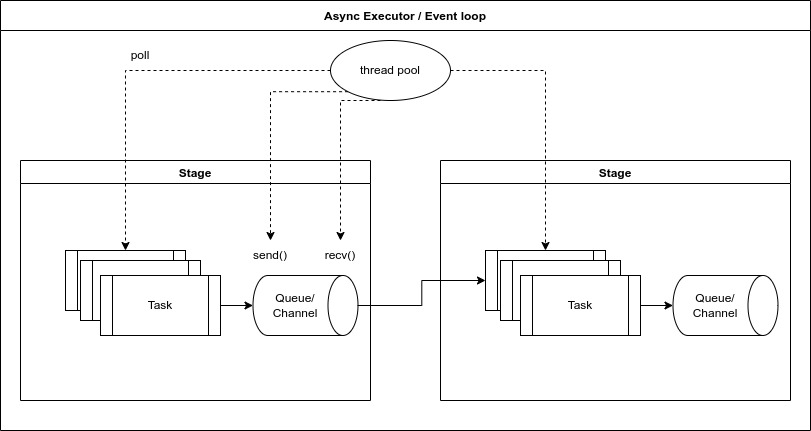

# Parallelism and Pipelining

The parallelism and pipelining can be achieved by combining tasks and
sender/receiver pattern together. It is a powerful building block to
express express various kinds of dataflow patterns.




## Pipelining in Worker Style

The pipelining can be done by concatenting multiple tasks together by
channels. For example, the following code spawns two tasks, namely the
`first_stage` and `second_stage`. The `first_stage` passes its output
values through as channel to `second_stage`.

```rust
async fn first_stage<T, F>(
    prev_rx: flume::Receiver<usize>,
    next_tx: flume::Sender<usize>,
)
{
    loop {
        let input = match rx.recv().await {
            Ok(msg) => msg,
            None => return
        };
        
        let output = input + 1;
        
        let ok = tx.send(output).await.is_ok();
        if !ok {
            break;
        }
    }
}

async fn second_stage<T, F>(
    prev_rx: flume::Receiver<usize>,
    next_tx: flume::Sender<usize>,
)
{
    loop {
        let input = match rx.recv().await {
            Ok(msg) => msg,
            None => return
        };
        
        let output = input * 2;
        
        let ok = tx.send(output).await.is_ok();
        if !ok {
            break;
        }
    }
}

let source = stream::repeat(7);
let (tx1, rx1) = flume::channel(2);
let (tx2, rx2) = flume::channel(2);

let first_task = first_stage(source, tx1);
let second_task = second_stage(rx1, tx2);
let last_task = spawn(async move {
    while let Some(final_value) = tx2.recv().await {
        println!("{}", n);
    }
});

join!(first_task, second_task, last_task);
```


## Pipelining in Stream Style

The writing above can be further simplied into the _stream style_. It
does not require the user to declare the senders/receivers
explicitly. They are implicitly inferred.

```rust
let source_stream = stream::repeat(7);

source_stream
    .while_then(|n| async move { // step 1
        n + 1
    })
    .while_then(|n| { // step 2
        n * 2
    })
    .for_each(|n| {
        println!("{}", n);
    })
    .await;
```

## Scatter-Join Pattern in Worker Style

This example spawns two parallel tasks, both receiving values from the
same channel. An extra gathering task gathers the outputs from the two workers.

```rust
let (in_tx, in_rx) = flume::bounded(2);
let (out_tx, out_rx) = flume::bounded(2);

// data source

let source_task = spawn(async move {
    for n in 0..100 {
        let result = tx.send(n).await;
        if result.is_err() {
            break;
        }
    }
});

// first parallel worker

let in_rx1 = in_rx.clone();
let out_tx1 = out_tx.clone();

let first_par_worker = spawn(async move {
    while let Some(n) = in_rx1.recv() {
        let output = n + 1;
        let result = out_tx1.send(output).await;
        if result.is_err() {
            break;
        }
    }
});

// second parallel worker

let in_rx2 = in_rx.clone();
let out_tx2 = out_tx.clone();

let second_par_worker = spawn(async move {
    while let Some(n) = in_rx2.recv() {
        let output = n + 1;
        let result = out_tx2.send(output).await;
        if result.is_err() {
            break;
        }
    }
});

// gather outputs from both workers

let gather_task = spawn(async move {
    loop {
        let n = match select(out_rx1.recv(), out_rx2.recv()) {
            (Some(_), Some(_)) => unreachable!(),
            (Some(n), None) => n,
            (None, Some(n)) => n,
            (None, None) => break,
        };
        println!("{}", n);
    }
});

```

## Scatter-Join Pattern in Stream Style

The scatter-join pattern can be further simplified into the stream
style.

```rust
let source_stream = stream::iter(0..100);

source_stream
    .parallel_then(
        2,  // two workers
        |n| async move {
            n + 1
        }
    )
    .for_each(|n| {
        println!("{}", n);
    })
    .await;
```
