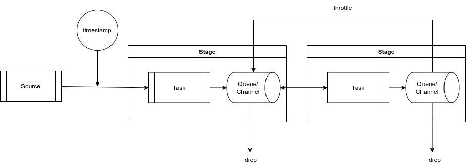

# Real-time Stream

The real-time data processing can be done by message timestamping. The
channels between tasks inherently checks the timestamps and drop the
messages if timeout occurs.




## Real-time Dataflow in Stream Style


```rust
let source_stream = stream::iter(0..100);

source_stream
    .with_timestamps()
    .timeout_then(|(ts, n)| {
        let new_n = heavy_computation(n);
        (ts, new_n)
    })
    .timeout_then(|(ts, n)| {
        let new_n = another_heavy_computation(n);
        (ts, new_n)
    })
    .for_each(|(ts, n)| async move {
        println!("get {} in {} seconds", n, ts.elapsed().as_seconds());
    })
    .await;
```
