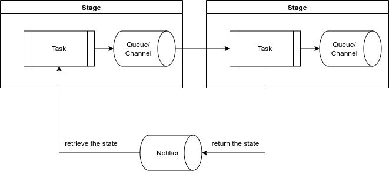

# Stateful Stream

The stateful stream can be implemented by collaborating with reverse
channels.



## Stream Style


```rust
let source_stream = stream::iter(100);

source_stream
    .with_state(0usize)  // set initial state to 0
    .then(|(n, state)| async move {
        *state += n;  // the state stores the acculative value
        *state        // output the state
    })
    .for_each(|acc| async move {
        println!("{}", acc);
    })
    .await;

```

## Worker Style


```rust
let (in_tx, in_rx) = flume::bounded(3);
let (for_tx, for_rx) = flume::bounded(3);
let (rev_tx, rev_rx) = flume::bounded(1);

rev_tx.send(0).await;  // put initial state 0 to the reverse channel

let first_state = spawn(async move {
    for n in 0..100 {
        let result = in_tx.send(n).await;
        if result.is_err() {
            break;
        }
    }
});

let first_stage = spawn(async move {
    loop {
        let (input, state) = join(in_rx.recv(), rev_rx.recv());
        let result = for_tx.send((input, state)).await;
        if result.is_err() {
            break;
        }
    }
});

let second_stage = spawn(async move {
    while let Some((n, state)) = for_rx.recv() {
        let new_state = n + state;
        let output = new_state;
        
        let result = rev_tx.send(new_state).await;
        if result.is_err() {
            break;
        }
        
        println!("{}", output);
    }
});
```


